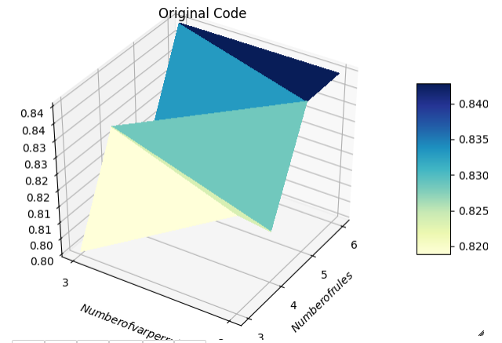
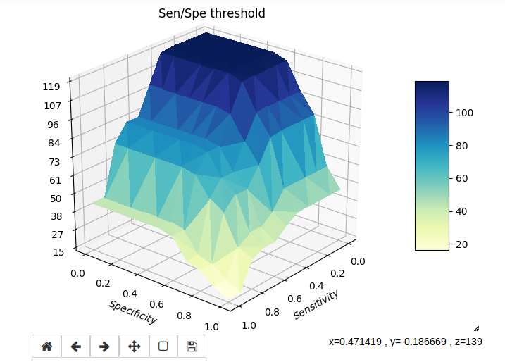
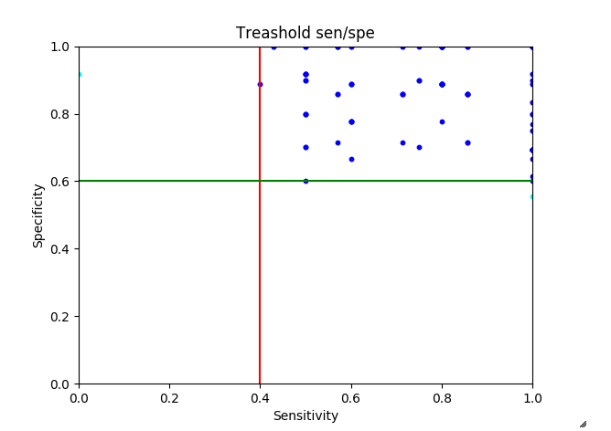
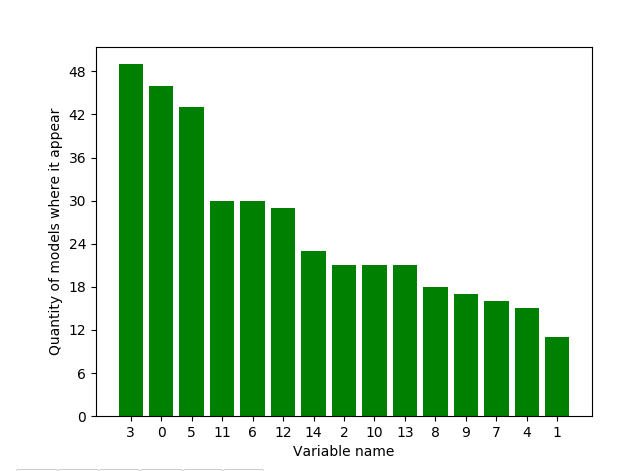
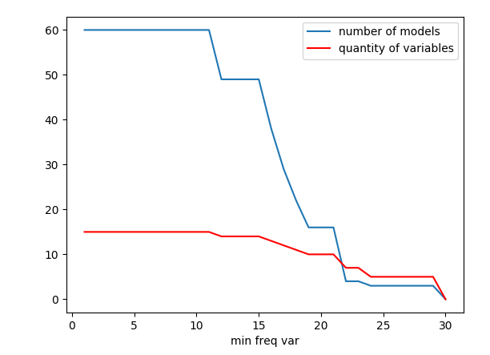
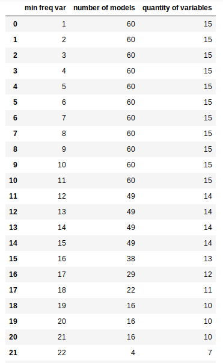
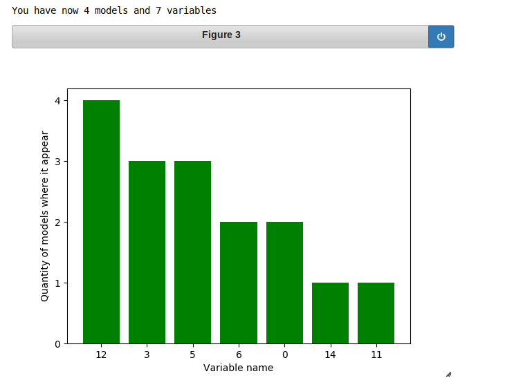
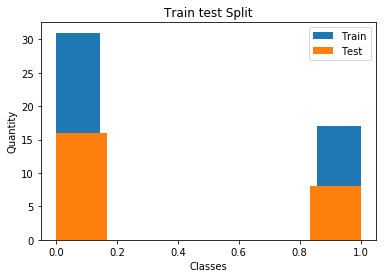

# MSE - MLDB - Lab 4 - TREFLE
## Authors:
- Romain Claret
- Edward Ransome

## Introduction
In this lab, we will use three datasets (Cancer, BCWD, GOLUB) and apply various fuzzy logic models to them using the Trefl library.

## Dataset cancer
### Question 1
- The original dataset shape is (208, 17).
    - X shape: (208, 15)
    - y shape: (208,)

The train/test seperation is done using a 66/33 split for all datasets. 

We can see that there are more data points of class 0 than of class 1 (twice as many) but they are well distributed in the train/test split (the training set is always twice as large as the test set for both classes).

### Question 2
The number of rules indicates how many rules will be generated in the model. This will affect calculation time, but will increase accuracy on the training set.  To choose the optimal number of rules, one must refer to literature. However one can choose too many rules and overfit on the training data since some rules will represent noise in the data.

Variables per rule indicated how many variables can be used when defining a rule, for example the rule "IF v11 is low AND v4 is low THEN [0]" contains two variables. This means a rule can be more or less complex based on the number of variables: if many features interact to give a certain class, i.e. the problem is complex, more variables must be used per rule.

### Question 3
If we assume each rule uses different features, we can have at maximum 5*6 = 30 features used. However, the same variable can appear in multiple rules in practice.

### Question 4

Since the dataset has the lowest number of features (15), we decided to test lower amounts of combinations of rules/variables per rule for this dataset. Due to time constraints on the calculations, we decided for this dataset to only test two amounts of variables per rule (2 or 3). This reduces the combinations and allowed us to test from 3-6 rules. In hindsight however, with more time, we would have prefered to add 4 variables per rule to see the effects, even though with only 15 features we suspect it would lead to rules being based on noise rather that the underlying data.

### Question 5
We can see from the 3D visualisation that the number of rules increases accuracy until 5 rules are reached, at this point the values flatten out. The number of variables per rule did not highly affect the results between 2 and 3 variables. We therefore feel the ideal combination for this dataset is 6 rules with 2 variables per rule.

### Question 6
Ideally our first search would have been quite coarse and then refined during this step, however our initial search was quite specific since the dataset has few features. Therefore for this dataset our "refined" search consists of 2 to 3 variables per rule and 5 to 6 rules. These are settings that already appear in the initial search however. For the other datasets, the search will be more refined.
### Question 7

### Question 8
We can see from the frequency chart (first chart) that all variables appear in at least 10 models. The number of appearances seems to follow a relatively linear order, however only the variables up to 14 (on the x-axis) are included in more than a third of all models. The threshold chart (second chart) and variable table allow us to see that with a variable frequency minimum of 21, we can reduce our 60 models to only 4 models with 7 variables (the number of variables with a higher frequency than 14 on the first chart). This gives us a very small number of models that we can accurately test and use definitively. 

The remaining variables are the following:

## Dataset BCWD
### Question 1
- The original dataset shape is (569, 32).
    - X shape: (569, 30)
    - y shape: (569,)
- We are using a train/test split of 66/33 for whole dataset. (381, 30) (381,) / (188, 30) (188,)
- We see that there are about two times more data points for class 0 than for class 1.

### Question 4

Since this dataset has more features, we decided to use a more coarse search at this step: we use values quite far from each other so that for the next step we can use a more exact range based on the 3D visualisation.

### Question 6
### Question 7
### Question 8
### Question 9
### Question 10

## Dataset GOLUB
### Question 1
- The original dataset shapes:
    - train set is (38, 7129) (38,)
    - test set is (34, 7129) (34,)
    - The default dataset train/test split is 53/47. 
- We managed to force a train/test split of 66/33 for whole dataset. (48, 7129) (48,) (24, 7129) (24,)
- We see that there are about two times more data points for class 0 than for class 1.

n_generations=100,
Score on test set: 0.667

n_generations=200
Score on test set: 0.708

### Question 4
### Question 5
### Question 6
### Question 7
### Question 8
### Question 9
### Question 10

