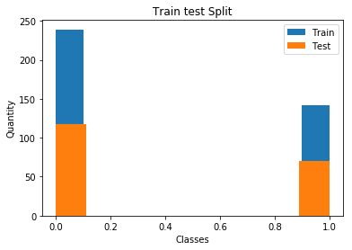

# MSE - MLDB - Lab 4 - TREFLE
## Authors:
- Romain Claret
- Edward Ransome

## Introduction
In this lab, we will use three datasets (Cancer, BCWD, GOLUB) and apply various fuzzy logic models to them using the Trefl library.

## Dataset cancer
### Question 1
- The original dataset shape is (208, 17).
    - X shape: (208, 15)
    - y shape: (208,)

The train/test seperation is done using a 66/33 split for all datasets. 

We can see that there are more data points of class 0 than of class 1 (twice as many) but they are well distributed in the train/test split (the training set is always twice as large as the test set for both classes).

### Question 2
The number of rules indicates how many rules will be generated in the model. This will affect calculation time, but will increase accuracy on the training set.  To choose the optimal number of rules, one must refer to literature. However one can choose too many rules and overfit on the training data since some rules will represent noise in the data.

Variables per rule indicated how many variables can be used when defining a rule, for example the rule "IF v11 is low AND v4 is low THEN [0]" contains two variables. This means a rule can be more or less complex based on the number of variables: if many features interact to give a certain class, i.e. the problem is complex, more variables must be used per rule.

### Question 3
If we assume each rule uses different features, we can have at maximum 5*6 = 30 features used. However, the same variable can appear in multiple rules in practice.

### Question 4
TODO

### Question 6
### Question 7
### Question 8

## Dataset BCWD
### Question 1
- The original dataset shape is (569, 32).
    - X shape: (569, 30)
    - y shape: (569,)
- We are using a train/test split of 66/33 for whole dataset. (381, 30) (381,) / (188, 30) (188,)
- We see that there are about two times more data points for class 0 than for class 1.

### Question 4
### Question 6
### Question 7
### Question 8
### Question 9
### Question 10

## Dataset GOLUB
### Question 1
- The original dataset shapes:
    - train set is (38, 7129) (38,)
    - test set is (34, 7129) (34,)
    - The default dataset train/test split is 53/47. 
- We managed to force a train/test split of 66/33 for whole dataset. (48, 7129) (48,) (24, 7129) (24,)
- We see that there are about two times more data points for class 0 than for class 1.

n_generations=100,
Score on test set: 0.667

n_generations=200
Score on test set: 0.708

### Question 4
### Question 5
### Question 6
### Question 7
### Question 8
### Question 9
### Question 10